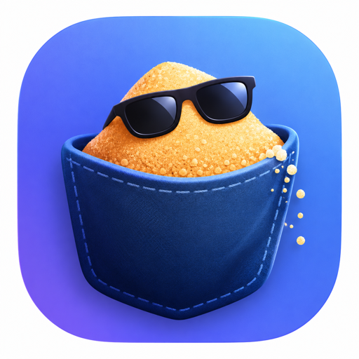
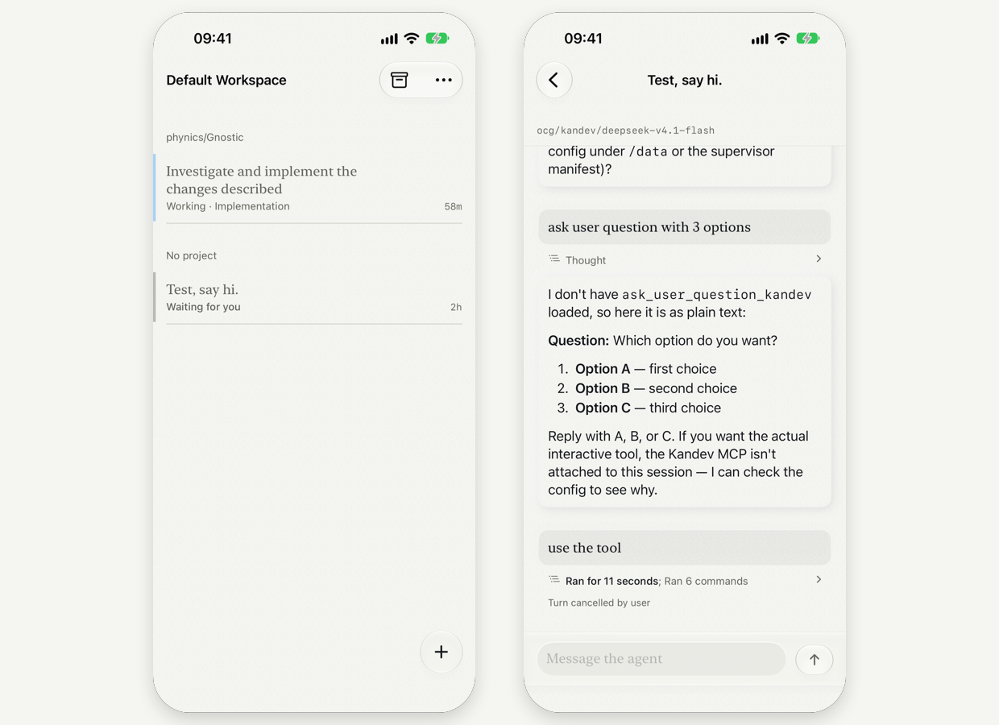

# Pocket Sand

<p align="center">
  
</p>

A native iOS and macOS client for a [Kandev](https://github.com/kdlbs/kandev)
server, using the interaction model of
[T3 Code](https://github.com/pingdotgg/t3code).

Tasks are the primary object. A task holds sessions; a session holds the
transcript. See [`CONTEXT.md`](CONTEXT.md) for the vocabulary and
[`docs/`](docs) for why it is built this way.

<p align="center">
  <picture>
    <source media="(prefers-color-scheme: dark)" srcset="assets/readme-dark.png">
    
  </picture>
</p>

## Requirements

- **iOS 26 / macOS 26**, and Xcode with the matching SDKs. The app is built on
  Liquid Glass and on SwiftUI APIs from that release; there is no fallback path.
- [XcodeGen](https://github.com/yonaskolb/XcodeGen). The Xcode project is
  generated, never committed, so `project.yml` is the only source of truth for
  the two app targets.
- Swift 6. `Packages/KandevKit` is a plain Swift package and builds on its own.

## Build

```bash
make gen           # xcodegen generate, via scripts/xcodegen
make build-ios     # iPhone 17 Pro simulator
make build-macos
make test          # swift test, offline, against KandevKit
```

`scripts/xcodegen` stages XcodeGen's setting presets before generating, because
the Nix package on the machine this was written on does not ship them. Run the
script, not `xcodegen` itself.

## Point it at a server

Type the address into the app on first launch. The one this was built against ran
on port 38429 over **plain HTTP**, which App Transport Security blocks, so both
`Info.plist` files set `NSAllowsArbitraryLoads` — the app only ever talks to an
address someone typed in themselves. If your server speaks HTTPS, that key can go.

For the live test suites, put your own address in a gitignored `local.mk`:

```bash
cp local.mk.example local.mk   # then edit KANDEV
make test-live                 # reads only, never starts an agent
```

`local.mk` is where a private server's address belongs: on the machine that can
reach it, not in a public repository.

## Layout

| Path | What lives there |
| --- | --- |
| `Apps/PocketSand/` | SwiftUI app, shared by both app targets |
| `Packages/KandevKit/` | Wire types, transport, state. No SwiftUI. |
| `docs/adr/` | Decisions that are expensive to reverse |
| `docs/design.md` | The visual vocabulary, and what was rejected |
| `docs/reference/` | Upstream documents, vendored so they can be read offline |
| `project.yml` | XcodeGen source of truth for both app targets |

`KandevKit` does not import SwiftUI and never touches a view. The app renders
state and calls into it; if a view needs data, it asks a store, and the store asks
the client.

## Status

A working read-and-write client for a Kandev server, at proof-of-concept depth.
Verified against a live **Kandev v0.96.0** server, not only against fixtures.

| Screen | State |
| --- | --- |
| Connect — address and an optional token | Working |
| Task list — subtasks nested, a state spine per row, ordered by last activity | Working, live |
| Transcript — turns, one-line steps, the current step as a paragraph | Working, live |
| A turn's work — opened as a sheet, with the exchange around it | Working |
| Composer — one button: send, stop, or send-now | Working |
| Start a session — choose an agent profile and run it on a task | Working |
| New task — title, brief, workflow, step, agent | Working |
| Move a task — tap its step, see what the move will do, commit | Working |
| Archive or delete — swipe a row, confirm | Working |
| Archive view — show archived tasks and put them back | Working |

Everything follows the server live, with no polling: the task list takes new work
and loses deleted work on its own, a row's spine follows the session's state, and
a conversation follows the agent's newest message with the transcript pinned to
the bottom unless you have scrolled up to read back. A dropped socket reconnects
with backoff and re-reads, and a screen that was left open overnight refreshes
when the app comes back — both debounced, because both arrive in bursts.

Not there yet: the board, files, diffs, terminals, markdown rendering in the
transcript, and moving a task *between* workflows rather than between steps of its
own.

## License

MIT. See [`LICENSE`](LICENSE).
